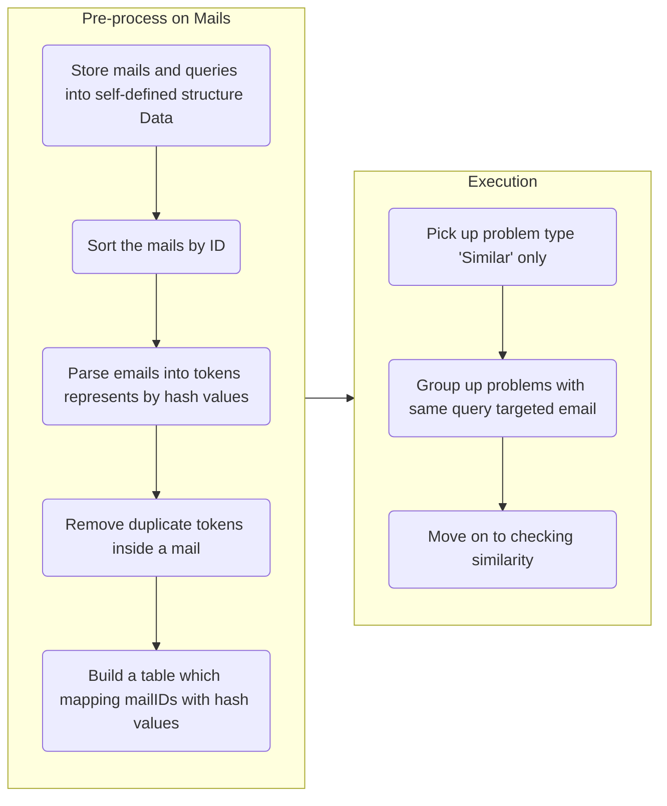

## Observations

### Hash
    
We observed that we have to hash tokens into integers in all types of queries. Therefore we must use an hash that ballances efficiency and collision frequency. We compare 2 different size hashes by 2 tests. 


|      | hash1 | hash2 |
| ---- | ----- | ----- |
| size | 32-bit | 64-bit |


#### test 1
The time cost of hashing a string(strlen=10) 10^8 times
```c=
for (int i = 1; i < 10^8; i++)
    hash(string);
```

|       | hash1 | hash2 |
| ----- | ----- | ----- |
| time cost | 1.99 s | 21.75 s |

#### test 2
Keep generating random string(strlen=10) and hash it. Stop if its hash collide with any hash generated before, or it has done 200000 times. Do this 100 times and get the average times.
```c=
array[200000];
for (int i = 0; i < 100; i++){
  int times = 0;
  bool collision = false;
  while (times < 200000 && !collision) {
    string = random_string();//strlen=10
    hash = Hash(string)
    for (int j = 0; j < times; j++){
        if (hash == array[j])
            collision = true;
    }
    array[times] = hash;
    times++;
  }
  all_times += times;
}
average_time = all_times / 100;
```


|   | hash1 | hash2 |
| - | -------- | -------- |
| average times |  83074    | 200000 (no collision)     |

According to test1 and test2, hash1 is better. It is 10 times faster than hash2. Though there are collisions, that's less enough.  

### Data Analysis

The mails are the subset of mails for the previous year, so we decided to take a glance at the data. Here are some information we gathered:

- 10000 mails
- 145434 unique tokens
- Number of unique tokens in mails:
    - averge: 157
    - median: 86
    - most mails have small token set
    - max: 3412


## Algorithms


### Group Analyse

This query requires us to treat each mail as a edge connecting the sender and the reciever then return the number of connected component and the size of the largest one. To maintain connected components, we use disjoint set method instead of graph searching method.

- Data structure: disjoint set
    - find set: $O(q \times \alpha(n))$
    - merge set: $O(q \times \alpha(n))$

Since the name of sender and reciever are strings, it's quite inconvenient to handle the graph. We remap the name set of size $N$ into a set of integer in range $[0, N)$ using the following algorithm:

- Push all the names into an array $A$
- Hash every elements in $A$ to an new array $H$
- Sort $H$
- Collect unique items $U$ in $H$
- Remap function for $str$:
    - hash $str$ to $h1$
    - hash $str$ to $h1$
    - binary search $h1$ on
    - $str$ is remapped to $i$

Finally, the problem can be solved using following algorithm:

- Create $N$ sets to represent every user
- For every mail:
    - remap the `sender` to `s` and `reciever` to `r`
    - merge set `r` and `s`
- The number of groups is equal the number of `i` such that `i == findSet(i)`
- The max set can also be maintain using a size array for each set

The time complexity of this algorithm is $O(N \log N)$ where $N$ is the number of mails. The threshold is the remap process. The space complexity is $O(N)$.

### Expression Match

In this type of query, we're asked to check if a expression is matched for any email, and output all emails satisfied the given expression. 

- Data Structure: Singly-linked-list

First, we execute some prepocess on the given expression by slicing it down into nodes of the linked list.

- Slicing Policy: 
    - Each node of the linked list contains expressions with `&` between, parentheses, or only a single token
    - Link between nodes implies `|` operations
    - Parentheses with only a token inside will be regards as a single token
    - `!` will be marked in the node of `(` or a single token

As we obtain the processed expression, we can further move on to checking if any emails matched the given expression via the following method. 

- Resolving Method
    - Use binary search to find out if a token exists in the email
    - As each node must represent a `true` / `false` value, use a recursive function to compute the sum of all nodes
    - Policy: 
        - Make new recursive call if encounter `(`
        - Return when a `)` appears
        
With the return value of the functions, we can have the sum of all nodes which is the result of doing `or` operation between each node. That is, $0$ represents failure on matching the expression with the email while nonzero values reveal that the expression is matched! 

#### Complexity Analysis
- Time complexity
    - $O(N)$ for the expression breaking down process, where $N$ denotes the length of the expression 
    - $O(Mlog(L))$ for the resolving process as $M$ denotes the number of tokens in the expression, and $log(L)$ denoted checking via binary search in $L$ items where $L$ is the number of tokens inside an email 
- Space Complexity
    - $O(N)$ for saving the expression into the linked-list, $N$ denotes the numbers of tokens and parentheses in an expression
        
### Similar

#### Grouping queries of same target mail

For similar queries, we are required to filter the mails which have similarity greater than a threshold with a target mail. Since there can be many queries sharing same target mail with different threshold, we group up the queries with same target together.

#### Original method

For every target mail, we need to calculate its similarity with all the other emails. At first we came up the following algorithm to caculate the similarity between two mails.

- hash the tokens for the two email
- sort the hashes for both email
- using binary search to check how many hashes in `emailA` are also in `emailB` to obtain the intersection $I$
- $similarity = \frac{I}{U} = \frac{I}{|A| + |B| - I}$

The time complexity for every query is $O(N \times M \times \log A)$ where $N$ is the number of mails and $A$ is the number of tokens in target email and $M$ is the total number of tokens of all mails.

#### Improvement of calculating intersection

Then we found that if we have the hashes sorted, we can use two pointers technique instead of binary search to calculate the intersection. Each intersection calculation will have time complexity $O(A + B)$ instead of $O(\min(A,B) \times \max(A,B))$, which is often faster in our scenario ($A, B$ is the number of tokens in two mails). So the time complexity for every query is $O(N \times X)$ where $X$ is the max token size.

#### Reverse matching optimization

To take a step further, we observed that many mails have low intersection. Which means we waste lots of time comparing hashes that does not match. So we came up with an reverse matching algorithm. Instead of finding common token between two mails, we find the mails that share the same token. This requires a pre-process of building the reverse table: `rev[token][x]` where `rev[token]` is an 1D array containg all the mailIDs with `token`.

We can now caculate the intersection with target mail using the reverse table:

- initialize the intersection of all mails to $0$
- iterate through the tokens `token` of target mail
    - iterate the mail `mail` contains `token` using the reverse table
        - increase the intersection between `target` and `mail`

The time complexity of every query become $O(\sum intersection[i])$. Although the worst case is same as the linear matching method, it's much faster in reality by the assumption of low intersection.

### Flowchart



## Result Analysis

### Variable

- $N$: Number of mails
- $M$: Sum of token size
- $X$: Max set size


### Time compexity

| Algorithm           | Pre-processing         | Per query                              |
| ------------------- | ---------------------- | -------------------------------------- |
| Group ($Z$ mails)   | $O(N \times X \log X)$ | $O(Z \times \alpha(Z))$                |
| Match               |                        |                                        |
| Similar Original    | $O(N \times X \log X)$ | $O(N \times M \log X)$                 |
| Linear Intersection | $O(N \times X \log X)$ | $O(N \times X)$                        |
| Reverse Matching    | $O(N \times X \log X)$ | $O(\sum intersection) = O(N \times X)$ |


## Conclusion

### Schedueling Strategy

We found out that the point per time we get among the type of query differs greatly. So we decided to only investigate time on similar query. Although we only do similar query, the order of the queries matters. We group the mails with same targetID together, then sort them according to the sum of rewards.

### Score

Finally, we score 77777777pts.

## Appendix I: Tools

We the following tools to support our development:

- [quom](https://github.com/Viatorus/quom): Generate a single c file from the sources for submission
- [crontab](https://man7.org/linux/man-pages/man5/crontab.5.html): We execute a auto submission script using crontab

## Appendix II: Repository Structure

```
├── src 
│    ├── io.h
│    ├── helper.h
│    ├── hash.h
│    ├── pick.h
│    ├── similar.h
│    ├── token_parser.h
│    └── token_table_gen.h
├── Makefile
├── convert.sh
└── main.c
```